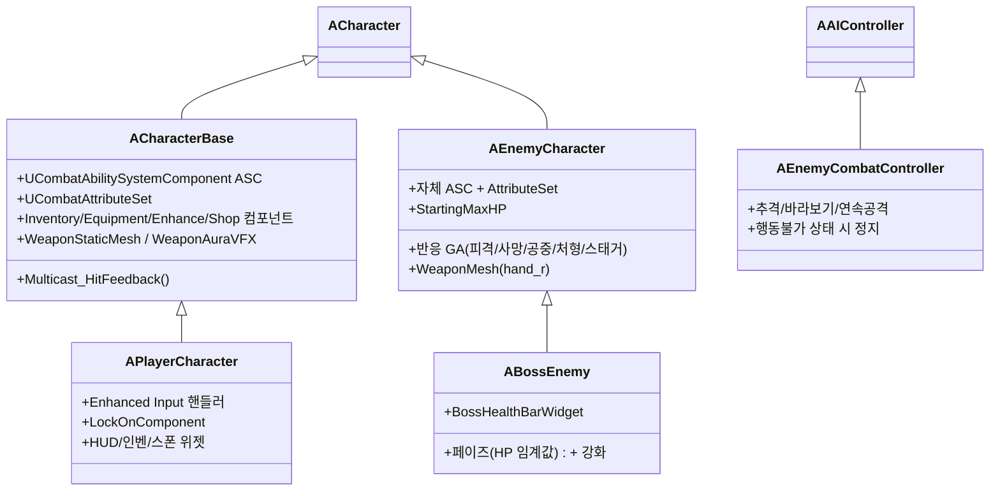
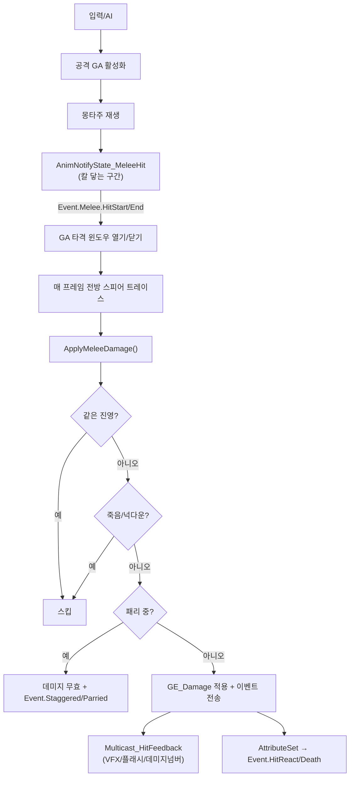

# StudyProject — 전투 시스템 구조도

UE5.7 / C++ + GAS(Gameplay Ability System) 기반 액션 전투 RPG. 단일/멀티(서버 권위) 지원.

---

## 1. 클래스 계층

- **ACharacterBase** : 플레이어 베이스. ASC + AttributeSet + 인벤/장비/강화/상점 컴포넌트 소유.
- **APlayerCharacter** : 입력 → GAS 라우팅, 록온, UI.
- **AEnemyCharacter** : GAS 적. 자체 ASC + 반응 어빌리티. **ABossEnemy** 가 이를 확장(페이즈/보스 HP바).
- **AEnemyCombatController** : BehaviorTree 없이 코드로 추격→공격하는 전투 AI.

---

## 2. GAS 어빌리티

| 어빌리티 | 소유 | 트리거 | 역할 |
|---|---|---|---|
| `UGA_Combo` | 플레이어 | Input.Attack | 지상 4타 콤보(데이터 기반, 캔슬 윈도우, 스텝인) |
| `UGA_AirCombo` | 플레이어 | Input.AirAttack | 공중 콤보(저글) — Combo 상속 |
| `UGA_Launcher` | 플레이어 | Input.Launcher | 적 띄우기 + 자기 체공(지상에서만) |
| `UGA_Finisher` | 플레이어 | Input.Finisher | 처형(카메라 연출, 멀티세이프) |
| `UGA_Dodge` | 플레이어 | Input.Dodge | 8방향 회피(거리 보간) |
| `UGA_JustCounter` | 플레이어 | Input.Parry | 패리 윈도우 + 리포스트 |
| `UGA_EnemyAttack` | 적 | AI | 근접 공격(노티파이 판정, PlayRate 텔레그래프) |
| `UGA_AirLaunch` | 적 | Event.Launched / Event.Slammed | 공중 피격/저글/슬램 → 착지 넉다운 → 기상 |
| `UGA_HitReact / Death / Executed` | 적 | Event.* | 피격/사망/처형 반응 |
| `UGA_Stagger` | 적 | Event.Staggered | 패리당함 → 경직 |

모든 전투 GA는 `UCombatGameplayAbility` 상속(InstancedPerActor, LocalPredicted). 공용 `ApplyMeleeDamage()` 보유.

---

## 3. 타격 판정 & 전투 흐름

- **노티파이 기반 판정**: 타이머가 아니라 몽타주의 `AnimNotifyState_MeleeHit` 구간 동안만 판정 → 스윙 타이밍 정확.
- **중복/팀/사망·넉다운/패리** 필터 후 `GE_Damage`(SetByCaller) 적용.
- `UCombatAttributeSet::PostGameplayEffectExecute` 가 HP 차감 + `Event.HitReact`/`Event.Death` 전송 → 반응 GA 발동.

---

## 4. 데이터 / 컴포넌트 / UI

- **데이터테이블**
  - `DT_ComboData`(`FWeaponComboData`) : 무기 ItemID별 콤보/런처/처형 몽타주, 데미지, 타격감(`FHitFeel`), 스텝인(`FComboStepIn`), 런치/슬램 값. 행키 = 장착 무기 ItemID.
  - `DT_ItemData`(`FItemData`) : 아이템(무기 메시/스태틱 메시/그립 트랜스폼/강화 VFX/아이콘 등).
  - `DT_EnhanceRate` : 강화 확률/비용.
- **컴포넌트**: `Inventory` / `Equipment`(슬롯·무기 비주얼·강화레벨·오라) / `Enhance` / `Shop` / `Trade` / `LockOn`.
- **위젯(코드 전용)**: `SPBarWidget`(HP/SP), `DamageNumberWidget`, `BossHealthBarWidget`, `EnemySpawnerWidget`(디버그 스폰).

---

## 5. 멀티플레이 동기화

- **몽타주**: ASC가 시뮬레이트 프록시에 자동 복제.
- **이동/런치/대시/슬램**: CharacterMovement 위치 복제.
- **장비 메시·강화 오라·무기 강화레벨**: `OnRep_*`로 복제.
- **타격 피드백(VFX/플래시/데미지넘버)**: 서버 권위 `Multicast_HitFeedback`(데미지넘버는 각 클라 로컬).
- **글로벌 타임딜레이션(슬로모) 금지** — 모든 연출은 per-actor/로컬.
- **팀**: `ApplyMeleeDamage`에서 적↔적/플레이어↔플레이어 데미지 무효(아군 오사 방지).
